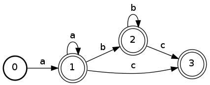

re2dotgraph
===========

Visualize a (non-POSIX) regular expression using pyFSA and dot


USAGE:
------
```sh
./re2dotgraph.py <regex> [file.png]
```


EXAMPLE:
--------
```sh
./re2dotgraph.py 'a+(b*)c?'

[+] Generating dot string ...
[+] Label: a+(b*)c?
[+] states: [1, 0, 2, 3]
[+] states count: 4
[+] initialState: 0
[+] finalStates: [1, 2, 3]
[+] alphabet: None
[+] transitions:
	(0, 1, <CharacterSet a>)
	(1, 1, <CharacterSet a>)
	(1, 2, <CharacterSet b>)
	(1, 3, <CharacterSet c>)
	(2, 2, <CharacterSet b>)
	(2, 3, <CharacterSet c>)

[+] Generating dot graph ...
[+] regex: 'a+(b*)c?' -> regex.png
```


GRAPH:
------


